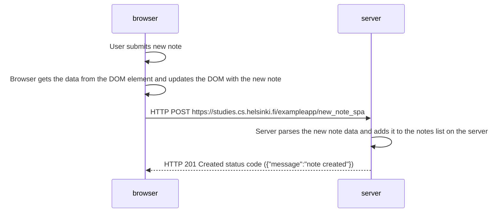

```mermaid

sequenceDiagram
    participant browser
    participant server

    browser->>browser: User submits new note
    browser->>browser: Browser gets the data from the DOM element and updates the DOM with the new note
    browser->>server: HTTP POST https://studies.cs.helsinki.fi/exampleapp/new_note_spa
    server->>server: Server parses the new note data and adds it to the notes list on the server
    server-->>browser: HTTP 201 Created status code ({"message":"note created"})
```
